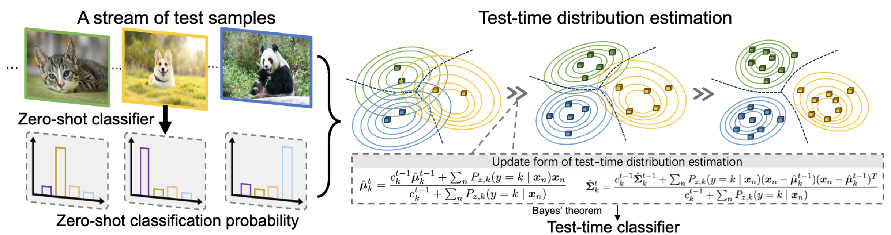

# [DOTA: Distributional Test-Time Adaptation of Vision-Language Models](https://arxiv.org/abs/2409.19375) *(NeurIPS'25)*

[](https://arxiv.org/abs/2409.19375)

This repository provides the official implementation of **DOTA: Distributional Test-Time Adaptation of Vision-Language Models**.

<p align="center">
  
</p>

### Overview

**DOTA** is a distributional test-time adaptation method for vision-language models. Instead of storing only a limited number of representative test samples, DOTA continually estimates the underlying distribution of test embeddings and computes posterior probabilities based on Bayes' theorem for online adaptation.


### Highlights

* **Distributional adaptation:** estimates class-conditional distributions of test embeddings.
* **Online test-time learning:** continually updates the test-time classifier as new samples arrive.
* **Training-free inference:** adapts CLIP without backpropagation or parameter updates.

### Method

DOTA builds a test-time distributional classifier on top of frozen CLIP features. Given incoming test samples, it first obtains zero-shot probabilistic predictions from CLIP and then uses them as soft supervision to update class-wise distribution estimates. The estimated distributions are further used to infer posterior probabilities for subsequent test samples.

---
## Test-Time Adaptation Landscape

Test-time adaptation (TTA) aims to improve model robustness under distribution shifts by adapting models or predictions using unlabeled test data. We organize representative studies into four broad lines, from classical classification models to vision-language models and recent benchmark-oriented analyses.

This section situates DOTA within the broader TTA literature; readers mainly interested in running the code can skip to [Usage](#usage).

---

### 🧩 1. Classical Test-Time Adaptation

This line studies TTA for standard classification models, such as CNNs and ViTs. The typical setting assumes a source-trained model and unlabeled target-domain test data, with adaptation performed through normalization statistics, unsupervised objectives, pseudo labels, or target-domain structure.

**Noisy-stream robustness and collapse prevention:**

* **[AdaBN](https://arxiv.org/abs/1603.04779)** *(arXiv'16)*: Recalibrates batch normalization statistics to reduce covariate shift.
* **[TTN](https://arxiv.org/abs/2302.05155)** *(ICLR'23)*: Learns to balance source and test normalization statistics for more stable adaptation.

**Test-time objective optimization:**

* **[TTT](https://arxiv.org/abs/1909.13231)** *(ICML'20)*: Uses self-supervised auxiliary tasks to update the model at test time.
* **[TENT](https://arxiv.org/abs/2006.10726)** *(ICLR'21)*: Minimizes prediction entropy by updating normalization affine parameters online.
* **[MEMO](https://arxiv.org/abs/2110.09506)** *(NeurIPS'22)*: Optimizes marginal entropy over augmented views of each test sample.

**Self-training and representation refinement:**

* **[T3A](https://proceedings.neurips.cc/paper/2021/hash/1415fe9fea0fa1e45dddcff5682239a0-Abstract.html)** *(NeurIPS'21)*: Adjusts the classifier using high-confidence target-domain features.
* **[AdaContrast](https://arxiv.org/abs/2204.10377)** *(CVPR'22)*: Combines contrastive learning with online pseudo-label refinement.
* **[TAST](https://arxiv.org/abs/2207.10792)** *(ICLR'23)*: Uses nearest-neighbor target structure to produce more reliable pseudo-label distributions.

---

### 🛡️ 2. Reliable and Realistic Test-Time Adaptation

This line focuses on whether TTA remains stable under practical test-time streams. Real deployments may involve noisy samples, non-i.i.d. order, small batches, class imbalance, evolving domains, or OOD inputs, where naive entropy minimization can cause overconfidence, error accumulation, or model collapse.

**Reliable sample selection and anti-forgetting:**

* **[EATA](https://arxiv.org/abs/2204.02610)** *(ICML'22)*: Selects reliable and non-redundant samples while regularizing against forgetting.
* **[SAR](https://arxiv.org/abs/2302.12400)** *(ICLR'23)*: Stabilizes entropy minimization with noisy-sample filtering and sharpness-aware updates.

**Continual and non-i.i.d. test streams:**

* **[CoTTA](https://arxiv.org/abs/2203.13591)** *(CVPR'22)*: Handles continually changing target domains with teacher-student averaging and stochastic restoration.
* **[NOTE](https://arxiv.org/abs/2208.05117)** *(NeurIPS'22)*: Addresses temporally correlated test streams with instance-aware normalization and balanced sampling.
* **[RoTTA](https://arxiv.org/abs/2303.13899)** *(CVPR'23)*: Uses robust normalization and memory sampling for dynamic real-world streams.

**Entropy reliability and collapse prevention:**

* **[SoTTA](https://arxiv.org/abs/2310.10074)** *(NeurIPS'23)*: Filters noisy test samples and improves robustness under noisy data streams.
* **[DeYO](https://arxiv.org/abs/2403.07366)** *(ICLR'24)*: Shows that entropy can be unreliable under biased scenarios and designs object-aware confidence estimation.
* **[COME](https://arxiv.org/abs/2410.10894)** *(ICLR'25)*: Replaces aggressive entropy minimization with conservative entropy minimization using Dirichlet uncertainty modeling.

---

### 🔎 3. Test-Time Adaptation for Vision-Language Models

This line extends TTA to vision-language models, especially CLIP-based recognition. Unlike classical classifiers, VLMs provide strong zero-shot priors from image-text pretraining, so VLM-TTA methods usually avoid heavy backbone updates and instead adapt prompts, predictions, caches, memories, prototypes, or test-time distributions.

**Prompt and lightweight parameter optimization:**

* **[TPT](https://arxiv.org/abs/2209.07511)** *(NeurIPS'22)*: Optimizes adaptive text prompts for each test sample via multi-view entropy minimization.
* **[DiffTPT](https://arxiv.org/abs/2308.06038)** *(ICCV'23)*: Uses diffusion-generated views to improve the diversity and reliability of prompt tuning.
* **[SwapPrompt](https://openreview.net/forum?id=EhdNQiOWgQ)** *(NeurIPS'23)*: Improves test-time prompt adaptation with self-supervised contrastive learning.
* **[PromptAlign](https://arxiv.org/abs/2311.01459)** *(NeurIPS'23)*: Aligns test-sample statistics with source statistics through prompt optimization.
* **[RLCF](https://arxiv.org/abs/2305.18010)** *(ICLR'24)*: Uses CLIP reward feedback to avoid blindly confident entropy minimization.
* **[C-TPT](https://arxiv.org/abs/2403.14119)** *(ICLR'24)*: Improves calibration in test-time prompt tuning via text feature dispersion.
* **[DynaPrompt](https://arxiv.org/abs/2501.16404)** *(ICLR'25)*: Maintains an online prompt buffer to exploit related test samples while reducing prompt collapse.

**Training-free inference and test-time augmentation:**

* **[DN](https://arxiv.org/abs/2302.11084)** *(NeurIPS'23)*: Normalizes test-time feature distributions to better match the contrastive pretraining objective.
* **[MTA](https://arxiv.org/abs/2405.02266)** *(arXiv'24)*: Uses MeanShift over augmented views as a training-free alternative to prompt learning.
* **[ZERO](https://arxiv.org/abs/2405.18330)** *(NeurIPS'24)*: Shows that augmentation, confidence filtering, and zero-temperature marginalization form a strong simple baseline.
* **[ECALP](https://arxiv.org/abs/2412.18303)** *(ICLR'25)*: Builds dynamic graphs over prompts, examples, and test samples for training-free label propagation.

**Cache, memory, and prototype-based adaptation:**

* **[TDA](https://arxiv.org/abs/2403.18293)** *(CVPR'24)*: Maintains a lightweight key-value cache of test features and pseudo labels for efficient online adaptation.
* **[DMN](https://arxiv.org/abs/2403.17589)** *(CVPR'24)*: Combines static and dynamic memory networks for zero-shot, few-shot, and training-free adaptation.
* **[BoostAdapter](https://arxiv.org/abs/2410.15430)** *(NeurIPS'24)*: Enhances cache-based adaptation with instance-aware regional bootstrapping.
* **[DPE](https://arxiv.org/abs/2410.12790)** *(NeurIPS'24)*: Evolves textual and visual prototypes to accumulate multi-modal target-domain knowledge.

**Distributional and probabilistic online adaptation:**

* **[DOTA](https://arxiv.org/abs/2409.19375)** *(NeurIPS'25)*: Moves beyond instance-level cache by continually estimating test-time distributions and computing posterior probabilities via Bayes' theorem.
* **[OGA](https://arxiv.org/abs/2501.04352)** *(arXiv'25)*: Models visual-feature likelihoods with Gaussian distributions and combines them with zero-shot priors.
* **[BCA](https://arxiv.org/abs/2503.09248)** *(CVPR'25)*: Updates both class embeddings and class priors from incoming posterior predictions.
* **[FreeTTA](https://arxiv.org/abs/2507.06973)** *(CVPR'25)*: Uses online EM to model test data distributions without storing full historical data.
* **[ADAPT](https://arxiv.org/abs/2508.15568)** *(NeurIPS'25)*: Reformulates VLM-TTA as Gaussian probabilistic inference with closed-form, training-free adaptation.

---

### 🧪 4. Benchmarks and Empirical Studies for Real-World TTA

This line studies whether TTA methods remain reliable under more realistic protocols. Instead of proposing only a new adaptation mechanism, these works analyze evaluation assumptions, noisy streams, OOD samples, calibration, robustness, and stability.

**Realistic and noisy VLM-TTA protocols:**

* **[Realistic TTA / StatA](https://arxiv.org/abs/2501.03729)** *(CVPR'25)*: Challenges favorable assumptions such as complete class coverage and i.i.d. test batches.
* **[Noisy TTA / AdaND](https://arxiv.org/abs/2502.14604)** *(ICLR'25)*: Studies VLM-TTA with out-of-label-space noisy samples and separates ID classification from noise detection.

**Unified benchmark and controlled analysis:**

* **[TTA-VLM](https://arxiv.org/abs/2506.24000)** *(NeurIPS'25)*: Provides a unified benchmark covering episodic and online VLM-TTA with metrics beyond accuracy.
* **[TTABC](https://arxiv.org/abs/2606.14299)** *(arXiv'26)*: Analyzes TTA for CLIP from the perspective of what is updated at test time.


---

## Usage

### Requirements

#### Installation

Follow these steps to create the conda environment and install the required packages:

```bash
conda create -n dota python=3.7
conda activate dota

# Results are produced with PyTorch 1.12.1 and CUDA 11.3
conda install pytorch==1.12.1 torchvision==0.13.1 torchaudio==0.12.1 cudatoolkit=11.3 -c pytorch

pip install -r requirements.txt
```

#### Dataset

To prepare the required datasets, please refer to [DATASETS.md](docs/DATASETS.md), which includes setup instructions for both benchmarks.

#### Skill

This repository includes a reusable skill in `skills/dota/` for AI coding agents to run, modify, and troubleshoot DOTA workflows. Agents can directly read this folder as project-specific operating guidance.

---

### Run DOTA

#### Configs

The hyperparameters of DOTA are defined in `configs/dataset.yaml`. You may adjust the configuration in this file according to different datasets or evaluation settings.

#### Running

Below are example scripts for running DOTA on both the Out-of-Distribution (OOD) and Cross-Domain benchmarks with **ViT-B/16**.

##### OOD Benchmark

```bash
bash ./scripts/run_ood_benchmark_vit.sh
```

##### Cross-Domain Benchmark

```bash
bash ./scripts/run_cd_benchmark_vit.sh
```

---

## Citation

If you find this repository useful for your research, please consider citing our paper.

```bibtex
@inproceedings{han2025dota,
  title     = {DOTA: Distributional Test-Time Adaptation of Vision-Language Models},
  author    = {Han, Zongbo and Yang, Jialong and Li, Junfan and Hu, Qinghua and Xu, Qianli and Shou, Mike Zheng and Zhang, Changqing},
  booktitle = {Advances in Neural Information Processing Systems},
  year      = {2025}
}
```

## Acknowledgement

This repository builds upon CLIP-based test-time adaptation research. We thank the authors of prior VLM-TTA methods and open-source projects for their valuable contributions to the community.
